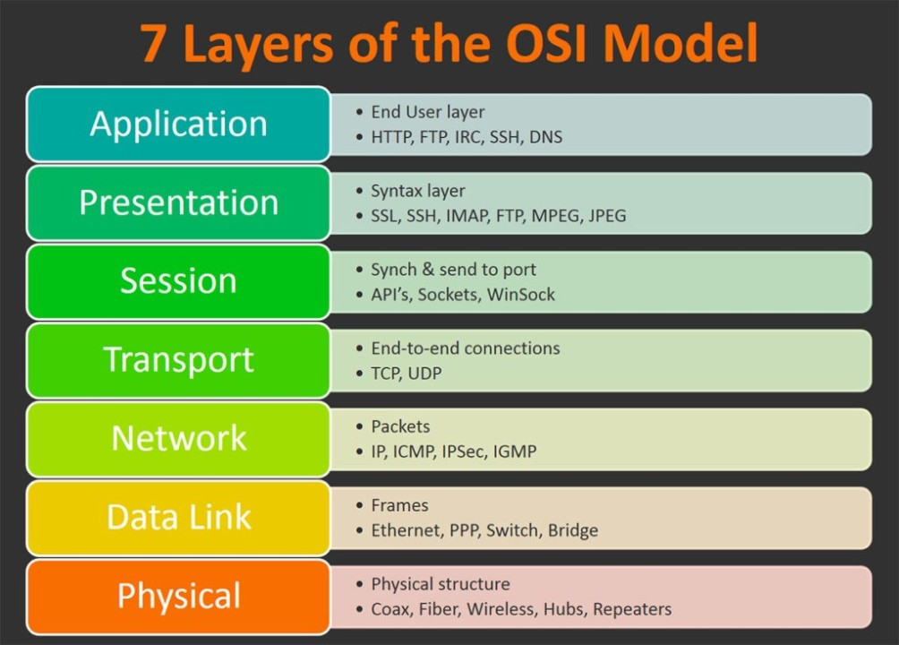

## Understanding Blockchain Technology

Blockchain is a distributed ledger technology that maintains a continuously growing list of records called "blocks." Each block contains a batch of transactions and a reference to the previous block, creating a chain of blocks that forms the blockchain. This structure ensures that every transaction in the network is linked to previous transactions, establishing an unbroken historical record.

## Decentralization and the Role of Nodes

In a traditional centralized system, a central authority would maintain and validate transactions. In contrast, the Bitcoin network operates in a decentralized manner, with nodes distributed worldwide. Each node contains a full copy of the blockchain and independently verifies and validates transactions, ensuring consensus and preventing a single point of failure.

## Transaction Verification and Consensus

When a user initiates a transaction, it is broadcast to the network. Nodes collect and verify these transactions before bundling them into a new block. The consensus mechanism, proof-of-work, ensures that only one valid block is added to the blockchain. This process prevents double-spending and ensures that the majority of the network agrees on the validity of the blockchain's state.

## Transparency and Immutability

Once a block is added to the blockchain, its contents are visible to all participants in the network. This transparency ensures accountability and trust, as anyone can audit and verify the transactions. Furthermore, the immutability of the blockchain, achieved through cryptographic hashing, makes it extremely challenging to alter historical records without altering subsequent blocks, preserving the integrity of the ledger.

## Bitcoin's Blockchain vs. Traditional Databases

Bitcoin's blockchain differs significantly from traditional databases, where a central authority typically manages data. In a database, records can be modified or deleted by authorized users, making it less secure and prone to potential tampering. In contrast, Bitcoin's blockchain is immutable and resistant to unauthorized changes.

## Smart Contracts and Programmability

Beyond transactions, blockchain technology enables the execution of "smart contracts" - self-executing contracts with predefined rules and conditions. Smart contracts automate processes and remove the need for intermediaries, enhancing efficiency and reducing costs.

## Scalability and Technical Challenges

While blockchain technology offers numerous advantages, it also faces challenges related to scalability, speed, and storage. As the number of transactions grows, ensuring fast and efficient processing becomes paramount. Various scalability solutions, such as the Lightning Network, aim to address these challenges and enable faster and more cost-effective transactions.

## Bitcoin's Layered Architecture

Just as the OSI (Open Systems Interconnection) Model provides a structured approach for comprehending complex networking systems, Bitcoin's layered architecture offers a similar structured framework for understanding its multifaceted nature. In the OSI Model, we traverse seven layers, mirroring the layered approach seen in Bitcoin's blockchain technology, where Layer 1 represents the blockchain itself and Layer 2 corresponds to the Lightning Network, exemplifying a systematic strategy to address intricate challenges.

Much like the OSI Model categorizes networking elements from the physical layer, dealing with cables and hardware, to the application layer, representing user-facing software, Bitcoin's layers draw a similar parallel. Layer 1, the foundational blockchain, is akin to the physical layer, while Layer 2, the Lightning Network, addresses scalability and usability, much like the higher OSI layers.

To provide a broader context, consider the internet as an embodiment of the OSI Model. The internet's layered architecture spans from the physical layer (Layer 1) to the application layer (Layer 7), much like the OSI Model itself. This layered structure, like the OSI Model, offers a structured approach to understanding and optimizing complex systems.

In this interplay of these frameworks - the OSI Model, Bitcoin's layered approach, and the internet's structured architecture - we witness how organized methodologies empower us to navigate and enhance intricate systems. These models have fostered transformative advancements, from the development of global communication networks to the evolution of cryptocurrency, highlighting the enduring influence of structured exploration in the pursuit of innovation.

## Conclusion

The technical foundations of blockchain technology have revolutionized the way we conceptualize and implement decentralized systems. In the case of Bitcoin, the marriage of informatics, cryptography, and consensus mechanisms has given rise to a groundbreaking financial ecosystem that challenges traditional norms and sets the stage for future innovations. This remarkable impact extends beyond the realm of Bitcoin, finding applications and connections in diverse fields of science, marking an exciting era of interdisciplinary exploration and technological advancement.
